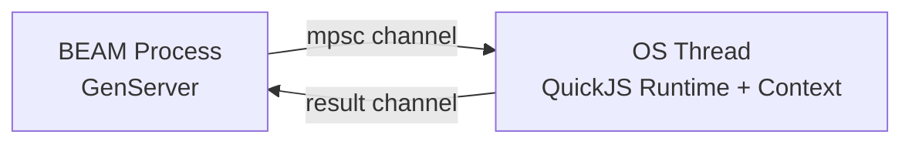

# QuickJSEx

[](https://hex.pm/packages/quickjs_ex)
[](https://hexdocs.pm/quickjs_ex)

Embedded [QuickJS-NG](https://quickjs-ng.github.io/quickjs/) JavaScript engine for Elixir via [Rustler](https://github.com/rusterlium/rustler) NIF.

- **No external runtime** — no Node.js, Bun, or Deno required
- **Precompiled binaries** — Rust toolchain is not required on most supported platforms
- **In-process** — runs inside the BEAM via a native extension
- **ES2023+** — async/await, Promises, Proxy, Map/Set, destructuring, modules
- **Isolated** — each runtime runs on a dedicated OS thread with its own JS context
- **Persistent state** — globals survive across evaluations within a runtime

## Installation

Add `quickjs_ex` to your list of dependencies in `mix.exs`:

```elixir
def deps do
  [
    {:quickjs_ex, "~> 0.3.0"}
  ]
end
```

On macOS, Linux, and Windows, precompiled NIFs are downloaded automatically for supported targets. If your platform is unsupported, or if you want to build locally, install Rust via [rustup](https://rustup.rs/) and set:

```bash
QUICKJS_EX_BUILD=true
```

Supported precompiled targets in `0.3.0`:

- macOS: `aarch64-apple-darwin`, `x86_64-apple-darwin`
- Linux: `aarch64-unknown-linux-gnu`, `x86_64-unknown-linux-gnu`, `x86_64-unknown-linux-musl`
- Windows: `x86_64-pc-windows-gnu`, `x86_64-pc-windows-msvc`

## Usage

```elixir
{:ok, rt} = QuickJSEx.start()

{:ok, 3} = QuickJSEx.eval(rt, "1 + 2")
{:ok, "hello"} = QuickJSEx.eval(rt, "'hello'")
{:ok, %{"a" => 1}} = QuickJSEx.eval(rt, "({a: 1})")

{:ok, _} = QuickJSEx.eval(rt, "globalThis.counter = 0")
{:ok, _} = QuickJSEx.eval(rt, "counter += 1")
{:ok, 1} = QuickJSEx.eval(rt, "counter")

QuickJSEx.stop(rt)
```

## Async JavaScript

Top-level `await` works in `eval/2`, and `call/3` automatically awaits Promise-returning functions:

```elixir
{:ok, rt} = QuickJSEx.start()

{:ok, values} =
  QuickJSEx.eval(rt, """
  await Promise.all([
    Promise.resolve(1),
    Promise.resolve(2),
    Promise.resolve(3)
  ])
  """)

{:ok, _} =
  QuickJSEx.eval(rt, """
  async function greet(name) {
    return `hi ${name}`;
  }
  """)

{:ok, [1, 2, 3]} = {:ok, values}
{:ok, "hi world"} = QuickJSEx.call(rt, "greet", ["world"])
```

## Calling Functions

Use `call/3` to invoke global functions with Elixir values:

```elixir
{:ok, rt} = QuickJSEx.start()

{:ok, _} =
  QuickJSEx.eval(rt, """
  function sum(values) {
    return values.reduce((acc, n) => acc + n, 0);
  }
  """)

{:ok, 10} = QuickJSEx.call(rt, "sum", [[1, 2, 3, 4]])
```

## ES Modules

Load ES modules built with Vite, esbuild, or Rollup. Named exports are promoted to `globalThis`, so they can be called with `call/3` or accessed with `eval/2`:

```elixir
{:ok, rt} = QuickJSEx.start()

:ok = QuickJSEx.load_module(rt, "math", """
export function add(a, b) { return a + b; }
export const PI = 3.14159;
""")

{:ok, 5} = QuickJSEx.call(rt, "add", [2, 3])
{:ok, 3.14159} = QuickJSEx.eval(rt, "PI")
```

`eval/2` also accepts code containing `export` statements and promotes those exports the same way:

```elixir
{:ok, rt} = QuickJSEx.start()

{:ok, _} =
  QuickJSEx.eval(rt, """
  const greeting = "hi";
  export function greet(name) { return greeting + " " + name; }
  export const PI = 3.14;
  """)

{:ok, "hi world"} = QuickJSEx.call(rt, "greet", ["world"])
{:ok, 3.14} = QuickJSEx.eval(rt, "PI")
```

## SSR and Browser Stubs

For SSR bundles that expect browser-like globals, start a runtime with `browser_stubs: true`:

```elixir
{:ok, rt} = QuickJSEx.start(browser_stubs: true)

:ok = QuickJSEx.load_module(rt, "server", File.read!("priv/static/server.js"))
{:ok, html} = QuickJSEx.call(rt, "render", ["MyComponent", %{count: 0}, %{}])
```

When enabled, the runtime installs browser-oriented stubs including:

- `window`, `document`, `navigator`, `location`
- `localStorage`, `sessionStorage`
- `process.env.NODE_ENV`
- `matchMedia`, `MutationObserver`, `ResizeObserver`, `IntersectionObserver`
- `Event`, `CustomEvent`, `requestAnimationFrame`, `getComputedStyle`

Async `render` functions are automatically awaited.

## Resetting a Runtime

Use `reset/1` to clear global state and loaded modules without restarting the GenServer:

```elixir
{:ok, rt} = QuickJSEx.start()

{:ok, _} = QuickJSEx.eval(rt, "globalThis.answer = 42")
{:ok, 42} = QuickJSEx.eval(rt, "answer")

:ok = QuickJSEx.reset(rt)
{:error, _reason} = QuickJSEx.eval(rt, "answer")
```

## Supervision

```elixir
children = [
  {QuickJSEx.Runtime, name: MyApp.JS, browser_stubs: true}
]

Supervisor.start_link(children, strategy: :one_for_one)

{:ok, 3} = QuickJSEx.eval(MyApp.JS, "1 + 2")
```

## Architecture

Each `QuickJSEx.Runtime` owns a dedicated OS thread running a QuickJS-NG context. The BEAM communicates with that thread over channels, so JavaScript execution does not block BEAM schedulers.



## License

[MIT](LICENSE)
